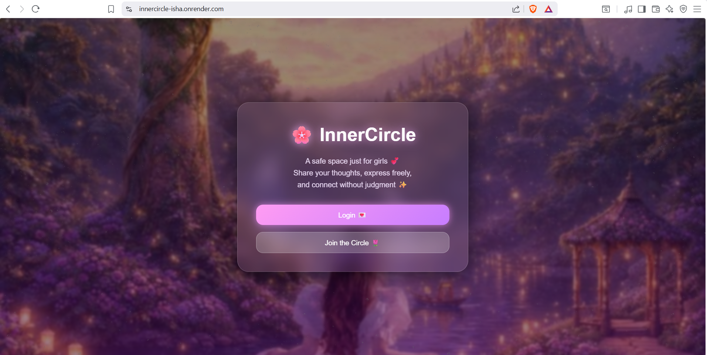
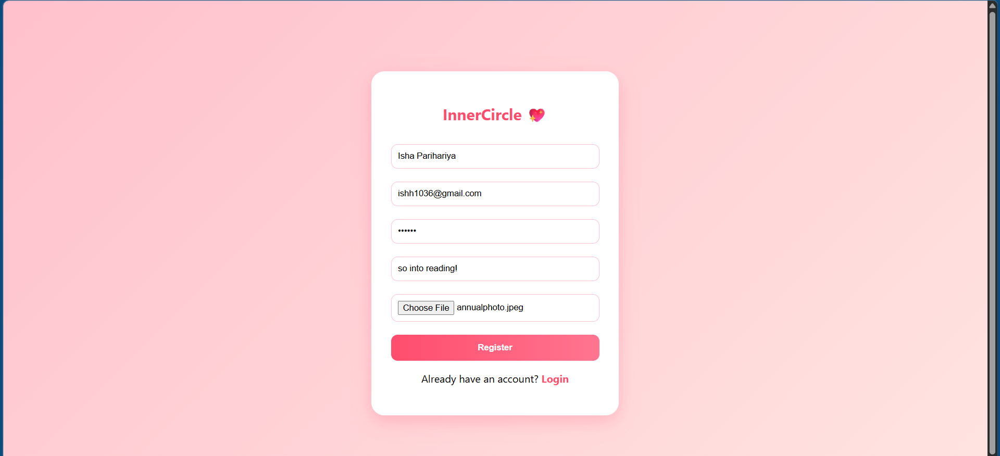
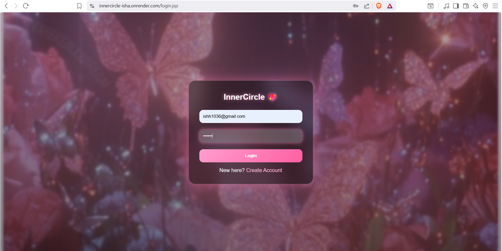
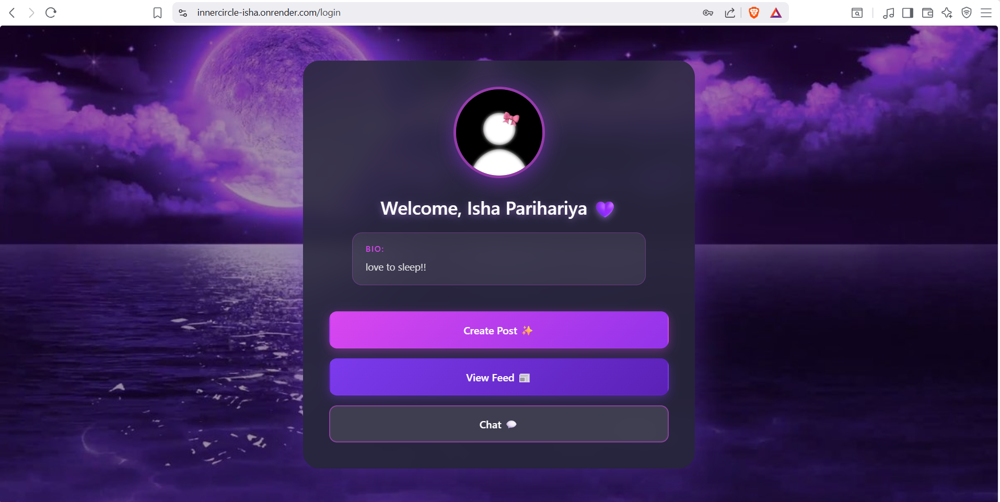
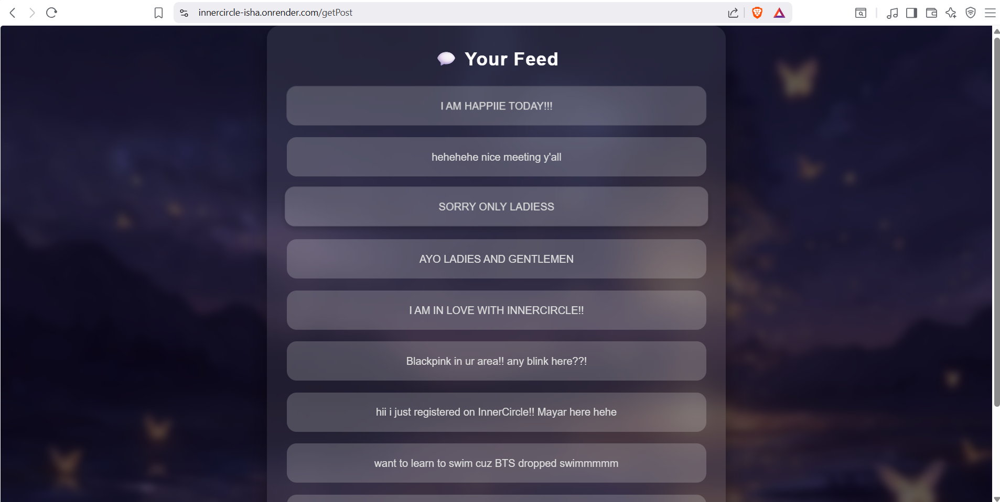
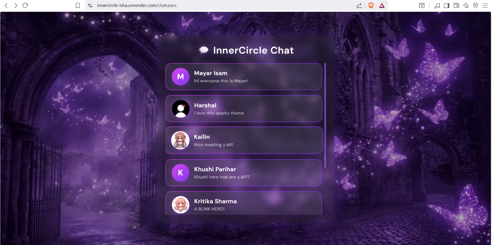
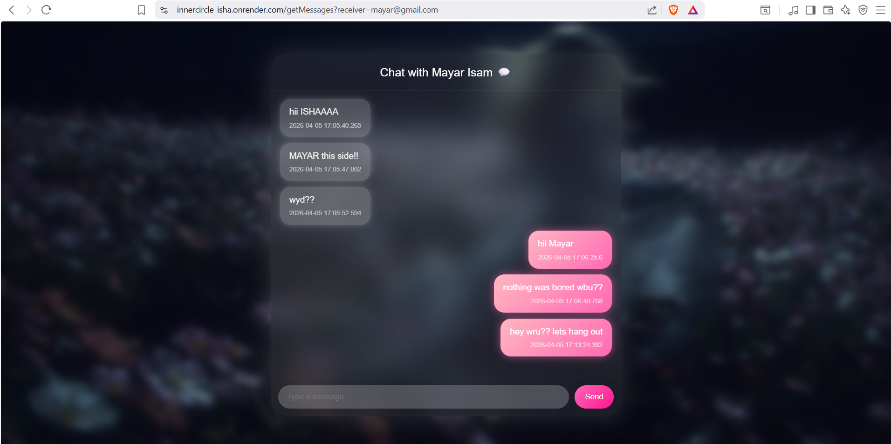
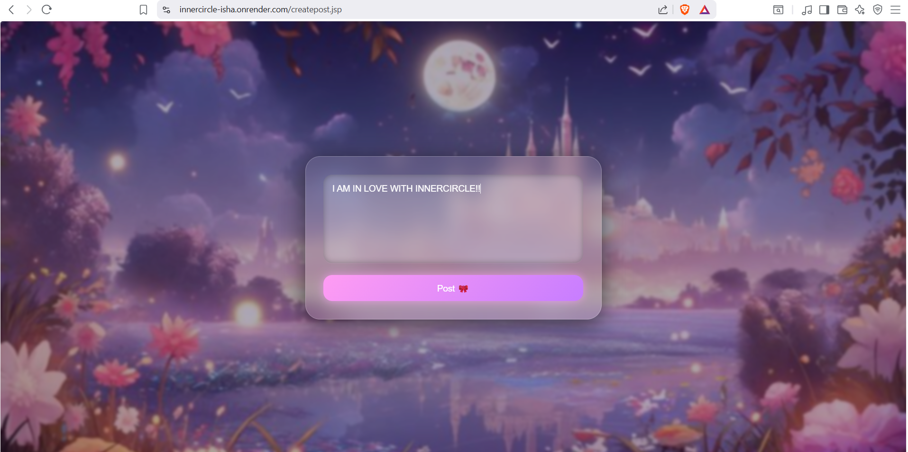

# 🌸 InnerCircle


A safe space just for girls 💕 Share your thoughts, express freely, and connect without judgment ✨

**InnerCircle** is a social networking platform designed specifically as a safe, supportive community where girls can share posts, chat in real-time, and build meaningful connections in a judgment-free environment.

🔗 **[Live Demo]((https://innercircle-isha.onrender.com))** 

---

## 🚀 Features

* 🔐 **User Registration & Login** - Secure authentication system
* 🧑‍💼 **User Profiles** - Personalized bio & profile picture
* 📝 **Post Feed** - Create and view posts from the community
* 💬 **Real-time Chat** - Connect with other users instantly
* 🖼️ **Image Upload** - Profile pictures stored securely in database
* 🧠 **Built with Hibernate + Servlets** (no Spring framework!)

---

## 🛠️ Tech Stack

| Technology | Purpose |
|------------|---------|
| **Java (Servlets & JSP)** | Backend logic & server-side rendering |
| **Hibernate ORM** | Database management & entity mapping |
| **PostgreSQL** | Cloud database (Superbase) |
| **HTML, CSS** | Frontend structure & styling |
| **Apache Tomcat** | Application server |
| **Supabase** | Cloud deployment platform |


---

## 🏗️ Project Structure

The project follows a layered architecture:

```
src/main/java/com/isha/
│
├── model → Entity classes (User, Post, ChatMessage)
├── dao → Database interaction (CRUD using Hibernate)
├── service → Business logic layer
├── servlet → Controller layer (handles HTTP requests)

webapp/
│
├── *.jsp → Frontend views (UI)
├── css/ → Styling

resources/
│
├── hibernate.cfg.xml
├── hibernatechat.cfg.xml
├── hibernatepost.cfg.xml

```
---

## 🧠 Architecture Overview

* **MVC Pattern** (Model-View-Controller)
* **Layered Architecture** (DAO → Service → Servlet)
* **ORM Mapping** with Hibernate for database operations
* **Session Management** for user authentication
* **File Handling** for profile pictures (stored as BYTEA in PostgreSQL)

---

## 📸 Application Screenshots

### 🏠 Home Page


### 📝 Register


### 🔐 Login


### 👩‍💼 User Account


### 📰 Feed


### 👥 Chat Users


### 💬 Chat


### 📮 Post


---

## 📋 Prerequisites

Before running this project locally, ensure you have:

- ☕ **Java JDK 11** or higher
- 🐱 **Apache Tomcat 10.x**
- 🐘 **PostgreSQL** (or use Supabase's cloud database)
- 💻 **IntelliJ IDEA** / Eclipse IDE
- 📦 **Maven** (for dependency management)

---

## ⚙️ How to Run Locally

### 1. Clone the Repository
```bash
git clone https://github.com/IshaParihariya/innercircle-project.git
cd innercircle-project
```

### 2. Open in Your IDE
- Open the project in **IntelliJ IDEA** or **Eclipse**
- Let Maven download all dependencies

### 3. Configure PostgreSQL Database

**Option A: Local Database**
- Create a database named `innercircle`
- Update credentials in `src/main/resources/hibernate.cfg.xml`:
```xml
<property name="hibernate.connection.url">jdbc:postgresql://localhost:5432/innercircle</property>
<property name="hibernate.connection.username">your_username</property>
<property name="hibernate.connection.password">your_password</property>
```

**Option B: Superbase Cloud Database**
- Use the connection string from your Supabase PostgreSQL instance
- Update the same properties in `hibernate.cfg.xml`

### 4. Configure Tomcat Server
- Add **Apache Tomcat 10.x** to your IDE
- Deploy the application to Tomcat
- Set context path to `/` or `/innercircle`

### 5. Run the Application
```bash
# Start Tomcat server from IDE
# Access at: http://localhost:8080
```

### 6. Database Tables
Hibernate will **auto-create** the necessary tables on first run thanks to:
```xml
<property name="hibernate.hbm2ddl.auto">update</property>
```

---

## 🌐 Deployment

This application is deployed on **Render** with:
- ✅ PostgreSQL Supabase cloud database
- ✅ Automatic deployments from GitHub
- ✅ HTTPS enabled by default

**Live URL:** [(https://innercircle-isha.onrender.com)]

---

## 🌟 Key Highlights

This project demonstrates:

✨ **Hibernate ORM** - Entity mapping, relationships, and fetching strategies  
✨ **File Handling** - Profile pictures stored as binary data (BYTEA)  
✨ **MVC Architecture** - Clean separation of concerns  
✨ **Full CRUD Operations** - Create, Read, Update, Delete functionality  
✨ **Session Management** - Secure user authentication  
✨ **Cloud Deployment** - Production-ready on Render

---

## 💡 Future Improvements

- [ ] Migrate to **Spring Boot** for better dependency injection
- [ ] Implement **WebSocket** for true real-time chat
- [ ] Add **likes & comments** on posts
- [ ] **Notification system** for new messages
- [ ] **Password encryption** with BCrypt
- [ ] **Responsive UI** with modern CSS framework
- [ ] **Search functionality** for users and posts
- [ ] **Email verification** on registration

---

## 👩‍💻 Author

**Isha Parihariya** 💖  
BTech CSE | Java Developer

---

## 🤝 Connect With Me

- 🐙 **GitHub:** [@IshaParihariya]([https://github.com/IshaParihariya])
- 💼 **LinkedIn:** www.linkedin.com/in/isha-parihariya-b9382126b
- 📧 **Email:** ishh1036@gmail.com

---

## ⭐ Show Your Support

If you like this project, please give it a ⭐ on GitHub!

---

<div align="center">
Made with 💖 by Isha Parihariya
</div>
